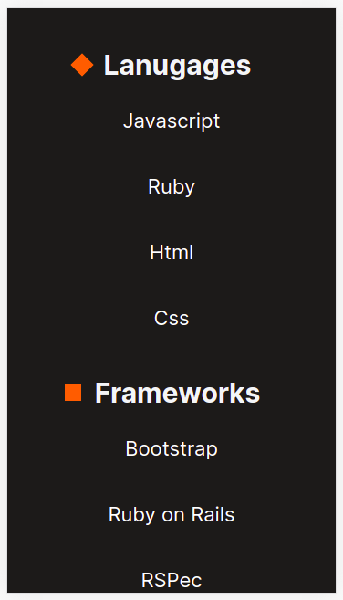

# My-microverse-portfolio-project

> This is the skeleton and setup of mobile version for my portfolio

![screenshot]
Headline                                          |  Recent Work
:------------------------------------------------:|:-----------------------------------------------:
  |  

Project Card                                      |  About Myself
:------------------------------------------------:|:-----------------------------------------------:
   |  

Categories                                        |  Contact Form
:------------------------------------------------:|:-----------------------------------------------:
  |    |

## Built With

- HTML & CSS

## Authors

👤 **Author1**

- GitHub: [@mmsesay](https://github.com/mmsesay)
- Twitter: [@DeeMaejor](https://twitter.com/DeeMaejor)
- LinkedIn: [LinkedIn](https://linkedin.com/in/muhammad-m-sesay)

👤 **Author2**

- GitHub: [@1GORDON](https://github.com/1GORDON)
- Twitter: [@GTinyefuza](https://twitter.com/Tinyefuza)
- LinkedIn: [LinkedIn](www.linkedin.com/in/tinyefuza-gordon-935747213 )

## 🤝 Contributing

Contributions, issues, and feature requests are welcome!

Feel free to check the [issues page](../../issues/).

## Show your support

Give a ⭐️ if you like this project!

## Acknowledgments
- microverseinc for the readme template